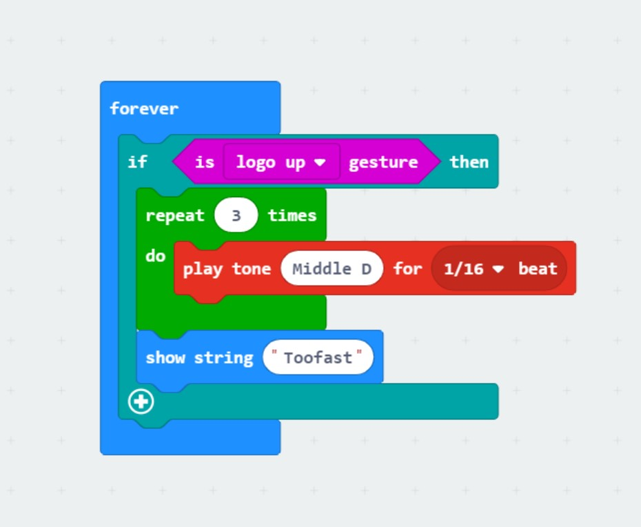

# 1701QCA Making Interaction - Assessment 2 workbook

You will use this workbook to keep track of your progress through the course and also as a process journal to document the making of your projects. The comments in italics throughout the template give suggestions about what to include. Feel free to delete those instructions when you have completed the sections.

When you have completed the template, submit the link to the GitHub Pages site for this repository as a link in Learning@Griffith. The link should be something like [https://qcainteractivemedia.github.io/1701QCA-Assessment2/](https://qcainteractivemedia.github.io/1701QCA-Assessment2/) where `qcainteractivemedia` is replaced with your GitHub username and `1701QCA-Assessment2` is replaced with whatever you called the repository this template is contained in when you set it up.

## Project working title ##
Interactive model Car 

## Related projects ##
*Find about 6 related projects to the project you choose. A project might be related through function, technology, materials, fabrication, concept, or code. Don't forget to place an image of the related project in the appropriate folder and insert the filename in the appropriate places below. Copy the markdown block of code below for each project you are showing.*

### Related project 1 ###
Racical phone has skin that feels your pinch 

https://www.fastcompany.com/90419364/this-radical-phone-has-skin-that-feels-your-pinch

This project is related to mine because this is one of the material and technology that can be used to build the robot car, such as it can sense the user action and react. It can sense pinch, pull, ticliing etc. Each action can be used to assign different function. This can save a lot of spaces for buttons and control unit. In my design, I might be able to achieve this by use the buttons or something simliar to the replicing project the fruit keyboard by turning other material to a button to make action to the micro bit. 

### Related project 2 ###
UI lit by the light in your room 

https://www.fastcompany.com/90288239/an-apple-alum-just-invented-the-next-skeuomorphism

This project is related to mine because this is the technology that can be used in the interior design in the car. Sometime we might find ourseleves consistantly adjusting the light in and outside the car. With this technology, the light will adjust itself by the environment. I think I can put this in my design using the light sensor in the mirco bit to dim and lit up the light. 

### Related project 3 ###
Interactive Mario Mushroom Block

https://www.hackster.io/sclandinin/interactive-mario-mushroom-block-2235dd

This project is related to mine because it used the acceleration sensor to activate an action. In my design concept, I want to use the acceleration sensor to trigger some action as well. Plus I can reference the use of the material since it look simple but effective and it is something I can build at home.  

### Related project 4 ###
Change RGB LED Connected to ESP12E from Web Page Using Knob

https://iotmonk.com/courses/change-rgb-led-connected-esp12e-web-page-using-knob/

This project is related to mine because it is a new way to control the color of the light. In one of my design concept, I want the user to able to control the light by the information recieved from the sensor. He used node MCU as his control module which in my case, I can use the micro bit. This inspired me a different way to let the user to control it. It might not need to be the exact same method but this apperantly could be a way out. 

### Related project 5 ###
WhatYouNeed( LED display base on data ) 

https://www.hackster.io/microBob/whatyouneed-

This project is related to mine because the technique it used to display on a LCD pixel monitor base on different data could be included in my design. The mirco-bit has a small pixel display itself, I might not be able have a external screen like this project shown, however, the idea of display different things base on different condition could be used in my design. I probably have to discover more code for the mirco-bit to be able to do that. 

### Related project 6 ###
Rocky Rover: Robotic Vision System PixyCam & Arduino 101

https://www.hackster.io/RONDAGDAG/rocky-rover-robotic-vision-system-pixycam-arduino-101-bd16f0

This project is related to mine because this gives me an idea to build the model car. When building a model car, the hardest part would be making the chassis to have a appropriate size and function. It need to be strong enought to hold the wheel and others part that might need to be on it. So this project has gave me a great idea of how to build the car and the element that might be needed to make it look like a 'car'. 

## Other research ##
*Include here any other relevant research you have done. This might include identifying readings, tutorials, videos, technical documents, or other resources that have been helpful. For each particular source, add a comment or two about why it is relevant or what you have taken from it.*

https://www.mantralabsglobal.com/blog/10-basic-principles-of-interaction-design/

This article is about the basic principles of interaction design. I used this principles to remind myself when I designing the final product. I found some of these principles very useful especially the affordability and functional minimalism. Sometimes I was a bit greddy and I want to put as much function in one design as I can but then it will be too complicated and messy, making it hard to use. So I learned to break it into different part and simplify the design. 

### *Brief resource name/description* ###

*Provide a link, reference, or whatever is required for somebody else to find the resource. Then provide a few comments about what you have drawn from the resource.*

https://web.archive.org/web/20130602154034/http://interactionivrea.org/proxy/src.php?dest=en%2Fabout%2Finteractiondesign%2Findex.asp

This article summary the general idea of interactive design. From sofeware to hardware as well as services Only when these three things are harmony together make a good interactive design. It also pointed out the different with traditional design and why is it important in today society. The real needs and possibilities to improve human existence are the is the main point of interactive design. This also reminds me there is a lot more interactive design in our life than we thought. 

## Conceptual progress ##

### Design intent ###

Improve the user experience of the car 

### Design concept 1 ###
*Outline three design concepts, each developed to a point where you anticipate it would be feasible to complete by the end of the course. Each should have a summary of the idea, a rough sketch of what it might be like, and any other notes you created while exploring the idea.* 

The first concept I want to put in the design is using the light sensor to achieve some action. I know there is some simliar excisting design out there but for this one I want to do more than automaticlly turn the light on and off I want the user have a choice, by add the button function I will let the user the choice the color of the light they intended to turn on.  

The photo shown some basic concept of the model car and the LED and seosor location.

https://youtu.be/TKhCr-dQMBY
This video show how the light level seosor works and after understanding it I am putting it in my design. 

### Design concept 2 ###

The second concept I want to put into the design is use the acceleration sensor to warn the user they are going too fast. Most of the accident on road is cause by the unwareness of the driver. It doesn't matter if the car is safe in emergency, the best way to prevent it is avoid the getting into danger situation. I want to make a warning sound using the buzzer, when the sensor sensed that the acceleration is over a certain number the buzzer will make a warning sound. Also considering to add more function to the model car toward the ultimate design.

The photo shown the buzzer and battery park location on the model car.

https://microbit-challenges.readthedocs.io/en/latest/tutorials/accelerometer.html

This link shown how the acclerometer work and I am going to learn how to use it and put it in the design. 

### Final design concept ###
*This more fully developed concept should include consideration of the interaction scheme, technical functionality, fabrication approach, materials to be used, and aesthetic.*

So the final concept is to join the first two idea together and design how to build the model car using some simple material. In the ultimate product, I will add some more function to the model car such as steering and more lighting effect. But for this stage, I would like to have a simple model to test if the concept is up to my design intent. 

This image shown the final concept of joinning the two inital idea together and the material I am going to use. And the location of each element. Also a list of upcoming feature I want to add to the final product.

### Interaction flowchart ###

This image shown the interaction flow between the product and the user. 

## Physical experimentation documentation ##

This is the code for the second concpet, buzzer to make the warning sound

This is the code for the first concept, display base on light level and allow user to select which color of light to turn.( no complete need improve)

This is the sketch for the simple model build, using some very basic material and it is a very rough model

This is the physical model I build 

This is another angel of the model

I am considering use something else for the wheels since it doesn't look like it is gonna work with the cardboard.

## Design process discussion ##
*Discuss your process in getting to this point, particularly with reference to aspects of the Double Diamond design methodology or other relevant design process.*

Up to this point, I already developed the final concept toward the ultimate design. However, I found the difficulty of building the physical product. In the aspects of the Double Diamond design methodology I already been through the discover and define stage, and I am now at the develop stage. And facing the stuggle moving toward the deliver stage, the outcome at this point is not satisfy. The code is partly working but it is still didn't work the way I want it to be. More testing and building is needed for the success of the final design. Think back to the reseach I have done earlier, I overcome the functional minimalism problem I always has, I break it into small part and try to join them together in the final product. It makes the design less messy and the function I put in is real need. 

## Next steps ##

1. Lots of improve on the physical product: I need to discover different ways to build the final product since it require a lot of testing and trying different material and see how they work.

2. Finalise the code for the light level and buzzer sound: Although the code is working, it still have rooms for improvement. Especially the function of the code at this stage is not fully fufill the inital design intent. 

3. Consider more function that can be add into the design to improve the user experience. 

4. Ask the tutor for advice and make changes on the design. 

5. Countinually discover simliar design online and see if there is some idea I can use to improve the final design.

6. Keep trying different things like code/ material, don't get stuck in one particular method! 

